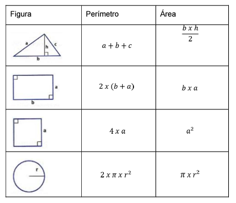

# Evidencia de desempeño: GA3-220501093-AA3-EV02 resolución a problemas algorítmicos aplicando estructuras de almacenamiento    

En esta actividad deberá aplicar todos los conocimientos adquiridos a lo largo del componente formativo para dar solución a problemas, utilizando todas las estructuras de control requeridas y el lenguaje JavaScript.  

# Problemas propuestos

Utilizando el lenguaje JavaScript desarrollar un programa que dé solución a los siguientes problemas:   

1. Desarrollar un programa que permita calcular el área o perímetro de algunas figuras planas según la siguiente tabla:     

Tabla 1  Área y perímetro de figuras planas

2. Desarrollar un programa que permita almacenar las edades de un grupo de 10 personas en un vector de enteros y luego determine la cantidad de personas que son menores de edad, mayores de edad, cuántos adultos mayores, la edad más baja, la edad más alta y el promedio de edades ingresadas. Para el ejercicio anterior suponga que un adulto mayor debe tener una edad igual o superior a 60. Debe validar para cada ingreso que los valores estén en un rango entre 1 y 120 años. En caso de error deberá notificar y solicitar un nuevo valor.

3. Escriba un programa que lea dos vectores de números enteros ordenados ascendentemente y luego produzca la lista ordenada de la mezcla de los dos, por ejemplo, si los dos arreglos tienen los números 1 3 6 9 17 y 2 4 10 17, respectivamente, la lista de números en la pantalla debe ser 1 2 3 4 6 9 10 17 17.  Limite los vectores a un tamaño de 5 y debe validar en cada ingreso que realmente se estén ingresando los datos de forma ascendente. 

4. Una emisora con presencia en diferentes ciudades desea conocer el rating de canciones y cantantes más escuchados (sonados) en este semestre del año. Por lo tanto, se ha pedido a estudiantes del SENA del programa de tecnólogo en análisis y desarrollo de software desarrollar una solución que permita conocer la respuesta de 6 personas con relación a sus gustos musicales. Con fines administrativos y realizar una rifa entre las personas encuestadas, la emisora desea poder registrar de las personas entrevistadas su nombre, número de identificación (cédula), fecha de nacimiento, correo electrónico, ciudad de residencia, ciudad de origen. Además, se deberá poder almacenar el artista y título de hasta 3 canciones favoritas en       GFPI-F-135 V01      cada una de las personas que se ingrese, teniendo en cuenta lo anterior, se sugiere que la solución deberá mostrar un menú que permite las siguientes opciones:    

a. Agregar una persona con los datos que se listan anteriormente. 
b. Mostrar la información personal de una persona particular por medio de su posición en el 
vector.  

# Elementos a tener en cuenta para la solución de este taller
● Cada problema se debe solucionar usando el lenguaje JavaScript. 
● Si bien existen muchas formas posibles de resolver un problema se recomienda utilizar las estructuras que permitan el desarrollo de acciones de una manera simple y eficiente.    

# Lineamientos generales para la entrega de la evidencia: 
● Producto a entregar: un único archivo comprimido con el nombre del estudiante donde se encuentren todas las soluciones a cada uno de los problemas propuestos. 
● Formato: ZIP. 
● Extensión: libre. 
● Para hacer el envío de la evidencia remítase al área de la actividad correspondiente y acceda al espacio resolución a problemas algorítmicos aplicando estructuras de almacenamiento. GA3-220501093AA3EV02.  